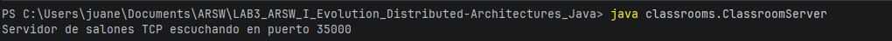
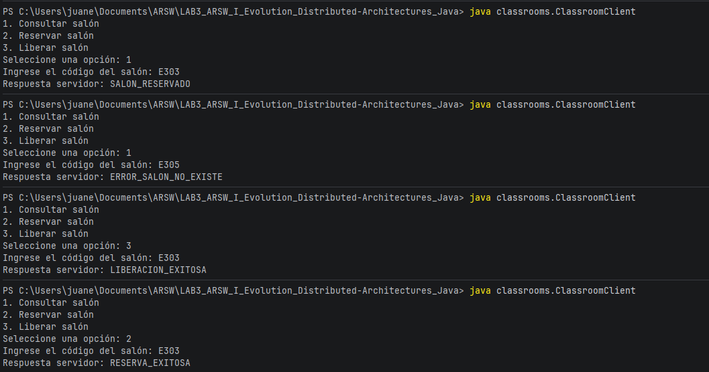
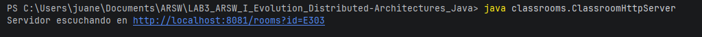
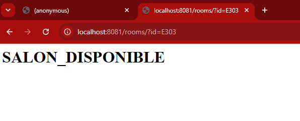
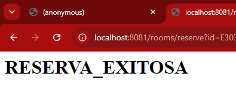
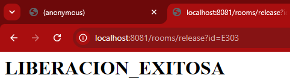
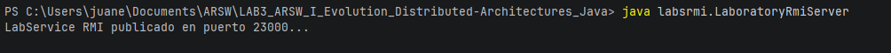
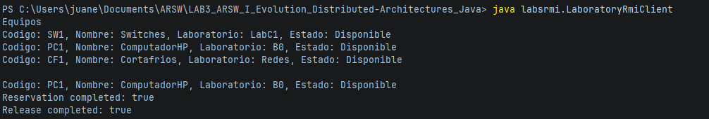

# LAB3 ARSW-i — Distributed Architectures Java
**Juan Esteban Rodríguez**

## Overview

This lab explores three different communication models used in distributed systems:

- Classroom Management using TCP Sockets
- Classroom Management using HTTP
- Laboratory Equipment Inventory using Java RMI

The purpose of the workshop is to understand how the same business concepts can be implemented through different communication paradigms, progressing from low-level socket communication to web-based communication and finally to Remote Procedure Calls (RPC).

---

## Part I — Classroom Management using TCP Sockets

### Description

This implementation uses TCP sockets and a custom text-based protocol to manage classroom reservations. The client establishes a direct connection with the server and sends textual commands representing the requested operation. The server processes these commands, interacts with the classroom repository, and returns a textual response indicating the result of the operation.

This approach provides a good introduction to socket programming because all aspects of communication must be handled manually, including message formats, request processing, and response generation. The client and server must share the same conventions regarding the structure and meaning of exchanged messages.


### How to Run

```bash
javac classrooms/*.java
java classrooms.ClassroomServer
```

In another terminal:

```bash
java classrooms.ClassroomClient
```

### Evidence





### Reflection Questions

**What would be required to add a new operation to the protocol?**

Adding a new operation is relatively simple, but both the client and server must be modified. A new command must be added to the protocol and implemented on both sides. As the number of operations increases, maintaining the protocol becomes more difficult.

**What happens if two clients try to reserve the same classroom at the same time?**

In the current implementation, requests are processed sequentially, so only one client can reserve the classroom first. The next client will receive a response indicating that the classroom is already reserved. In a concurrent implementation, synchronization mechanisms would be necessary to avoid race conditions.

**Where is the communication contract actually defined?**

The contract is not formally defined. It exists as a set of textual conventions agreed upon by the client and server. Both sides must understand the same commands and responses.

---

## Part II — Classroom Management using HTTP

### Description

This implementation transforms the classroom reservation system into an HTTP service. Instead of exchanging custom text messages through raw sockets, clients interact with the server using HTTP requests. The server exposes resources that can be accessed through standard web technologies and returns responses that can be displayed in a browser or consumed by other applications.

Using HTTP simplifies interoperability because the communication protocol is already standardized and widely supported. Clients no longer need to understand a custom protocol, and the service can be tested using common tools such as browsers, curl, or Postman.


### How to Run

```bash
javac classrooms/*.java
java classrooms.ClassroomHttpServer
```

Open:
http://localhost:8081/rooms?id=E303

Note: You can change the E303 for another code of class 

### Evidence









### Reflection Questions

**What advantages does HTTP provide over a manually defined text protocol?**

HTTP is a standardized protocol supported by browsers, servers, and development tools. It provides methods, status codes, headers, and content types that simplify integration and maintenance.

**What are the limitations of building an HTTP server without a framework?**

Developers must manually implement routing, parameter parsing, validation, and error handling. As the application grows, maintenance becomes more difficult compared to using a framework.

**How would this solution change if JSON were used instead of HTML?**

JSON would provide structured data that can be easily consumed by applications and services. This would improve interoperability and make the service more suitable for modern web and mobile applications.

---

## Part III — Laboratory Equipment Inventory using Java RMI

### Description

This implementation uses Java RMI (Remote Method Invocation) to provide access to a laboratory equipment inventory. Instead of exchanging messages through sockets or HTTP requests, clients invoke methods directly on remote objects. The RMI infrastructure is responsible for handling network communication and object serialization.

This approach follows the Remote Procedure Call (RPC) model, allowing distributed applications to interact through method calls that resemble local object interactions. The communication contract is explicitly defined through a shared Java interface, providing a higher level of abstraction than the previous implementations.


```bash
javac labsrmi/*.java
java labsrmi.LaboratoryRmiServer
```

In another terminal:

```bash
java labsrmi.LaboratoryRmiClient
```

### Evidence






### Reflection Questions

**What changed when moving from HTTP to RMI?**

With HTTP, communication occurs through requests sent to URLs. With RMI, communication occurs through direct method invocations on remote objects. The networking details are hidden behind the object-oriented interface.

**Where is the communication contract defined?**

The contract is formally defined in the remote interface shared by the client and server. This interface specifies the available operations and their signatures.

**What problems would this system have if a client were not written in Java?**

Java RMI depends on Java serialization, the JVM, and Java interfaces. As a result, interoperability with clients developed in other programming languages is limited.

---

## Conclusion

This workshop demonstrates three different approaches to distributed communication. TCP sockets provide full control over communication but require manual protocol design. HTTP introduces a standardized and interoperable communication model that is widely supported across platforms. Java RMI raises the level of abstraction by allowing remote services to be accessed through method invocations, simplifying distributed application development within the Java ecosystem. Understanding these approaches helps illustrate the trade-offs between flexibility, interoperability, and abstraction in distributed systems.